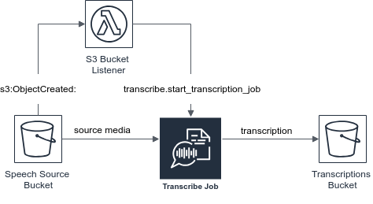

# AWS Speech Transcribing

The template defines 
- Source and destination S3 buckets to handle source audio and transcription files
- AWS Lambda function to administrate Amazon Transcribe service
- Roles and Policies required for the application

By default source bucket for audio files named *${AWS::AccountId}-${AWS::StackName}-voice*. 
The destination one (to hold transcription files) is *${AWS::AccountId}-${AWS::StackName}-transcriptions*. 
Both could be renamed during the template import.  

